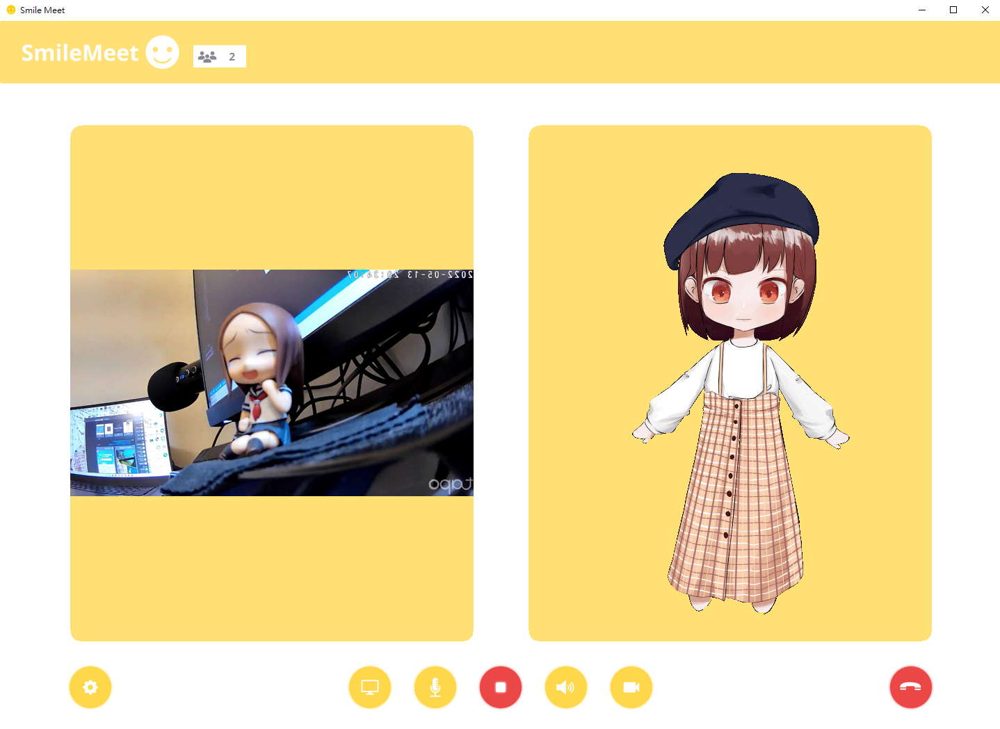
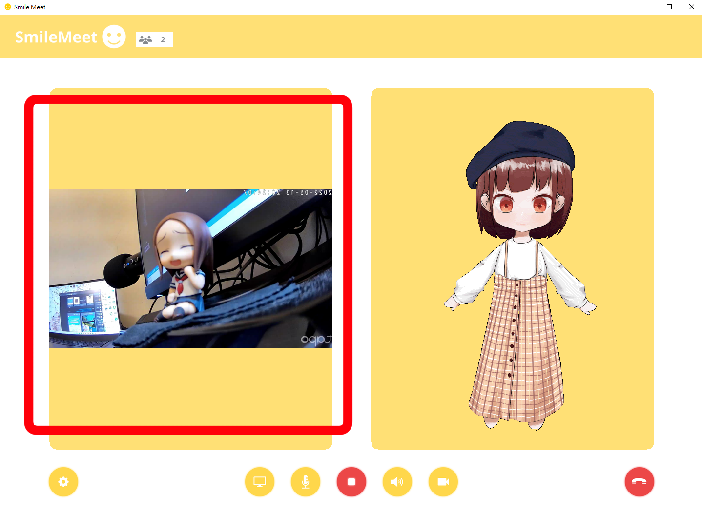
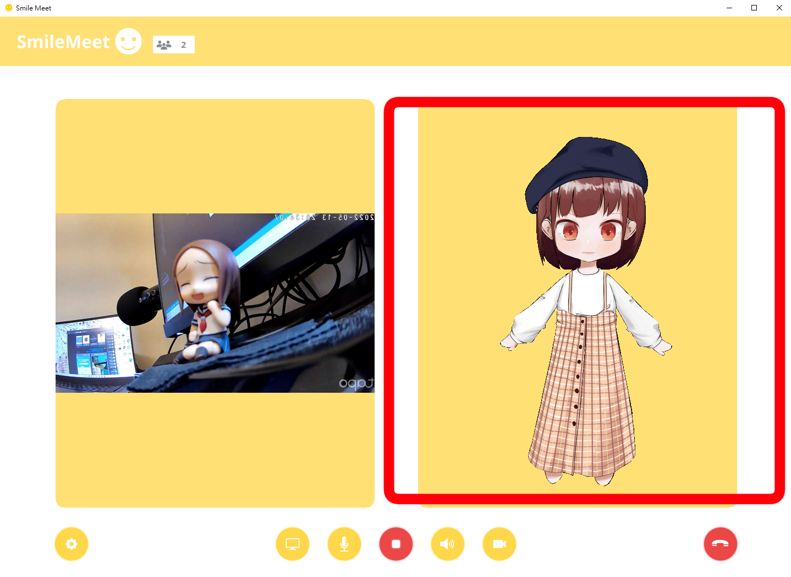

#  Smile Meet - 以微笑相遇

## Installation Steps (Works on PC)
- 下載及解壓縮檔案
- 準備好能執行Python的環境(開發環境為3.17.13,因此建議使用該版本)
- 安裝requirments內的套件
- 執行gui.py來運行程式 

Python (version 3.7.13)
```
cd build
pip install -r requirments.txt
python .\gui.py
```

Anaconda
```
cd build
conda create --name env python=3.7.13
conda activate env
pip install -r requirments.txt
python .\gui.py
```

## Overview

2019至今，新冠肺炎為這個世界帶來的十分重大的影響，也改變了這個世界的每一個角落，無論是遠距教學，梅花座用餐，等等，而最為顯著的，便是我們再也看不見每一個人的笑容，那一些燦爛的笑容都被口罩無情的隱藏，而這樣喪失表情資訊可能會造成孩子較難以去判別他人的情緒，也可能造成孩子因為缺乏表情作為參照，無法有效的利用表情或是臉部動作去表示自己的情緒，而無法利用表情動作去表達自己的情緒，除了在新冠時期底下成長的孩子以外，也有長期受到帕金森症影響的患者也有同樣面部情緒表達的問題，因此，在這樣的動機底下，我們決定設計出一款能夠幫助孩子以及病患訓練表情表達的應用程式，希望能夠藉由這樣的輔助程式，幫助孩子們練習表達自己的情緒，以及幫助患者訓練臉部肌肉，提高情緒表達力，以及延緩肌肉退化的速度。

Smile Meet - 又稱為微笑視訊，透過與Q版人偶互動的方式訓練、協調面部表情。更有著"以微笑相遇"的含意，希望藉由此應用程式可以帶給使用者更豐富的面部語言表達能力，人與人之間都能夠以更加豐富的表情相待。
## Play

UI畫面如下:


### 使用者視訊畫面 - 根據所選擇的攝影機顯示出相對應的畫面


### Q版人偶視訊畫面 - Smile Meet的表情表達Q版人偶的視訊畫面，她將會帶領你一起表達、學習表情


### 
### 攝影機選擇按鈕 - 按下即可切換欲使用的攝影鏡頭

### 
### 音量調節按鈕 - 按下即可調節應用程式的音量

### 
### 視訊鏡頭關閉按鈕 - 按下即可關閉視訊鏡頭

### 
### 表情模式開始按鈕 - 按下即可開始表情模式

### 表情模式介紹

當開啟表情模式，人偶便會隨機擺出表情，她擁有以下4種表情。
### 待機畫面


### 怒


### 哀


### 喜


### 驚


規則: 在表情模式中，每經過數秒就會進行一次的表情偵測，你可以透過使用"enter鍵"來作答，若是你沒有在時限內做出要求的表情，抑或是表情做錯的話它便會給出Correct或是Wrong的評判。


Note:當你的表情被偵測到時會顯示"I got you"若是沒有出現便不能偵測表情

## What's Next:
- 未來將會陸續新增更多種表情(ex:憂鬱、害羞等等)
- 未來將新增更多種Q版人物可供選擇
- 完善、增強模型辨識表情的效果。
